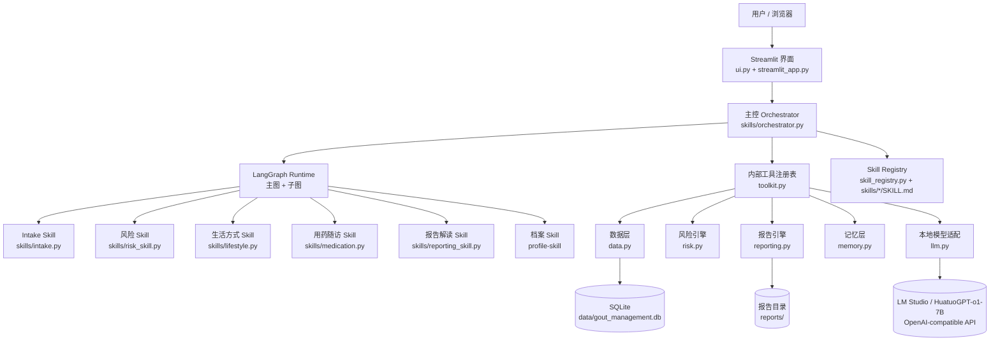
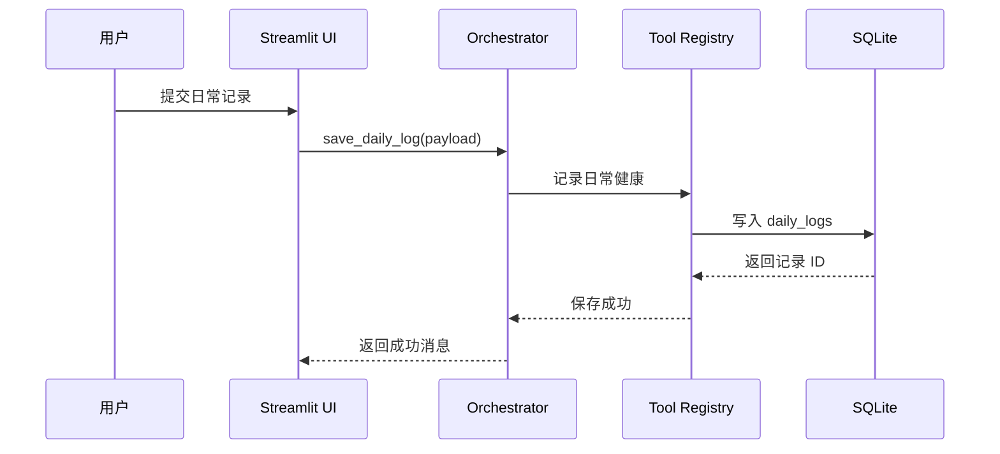
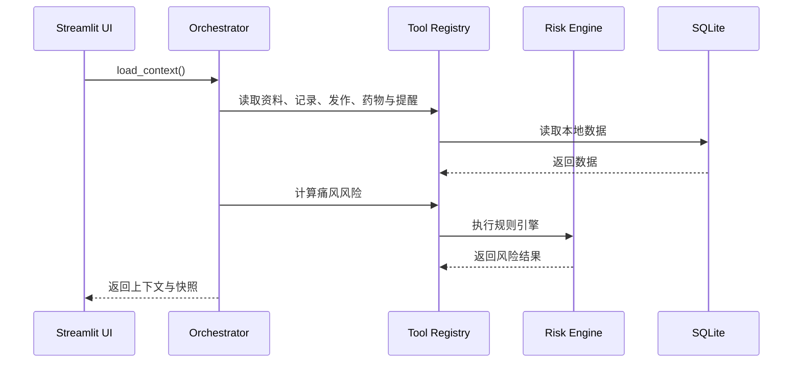
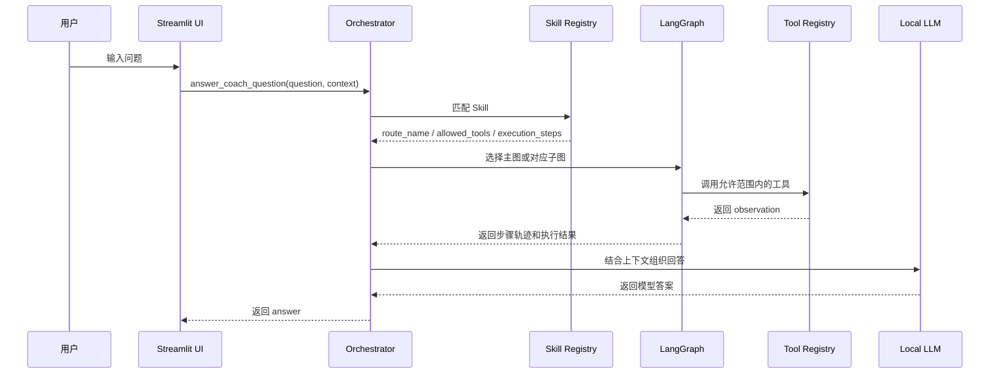

# 项目架构

## 总览

当前项目是一套面向痛风与高尿酸血症长期管理场景的本地优先应用，核心由五部分组成：

- Streamlit 中文界面
- SQLite 本地数据存储
- Skill 驱动的主控编排层
- LangGraph 运行时与路由级子图
- 规则引擎、本地模型与长期记忆

## 高层架构图

## 分层说明

### 1. 界面层

文件：
- `streamlit_app.py`
- `src/gout_agent/ui.py`

职责：
- 提供中文 Web 界面
- 管理总览、我的资料、记录、风险监测和 AI 管理助手页面
- 将用户操作交给 orchestrator

### 2. 编排层

文件：
- `src/gout_agent/skills/orchestrator.py`

职责：
- 加载上下文
- 根据 `SKILL.md` 和规则路由到对应 skill
- 基于 `allowed_tools` 约束工具调用
- 调用 LangGraph 主图或对应子图
- 在本地模型与规则回退之间组织最终回答

### 3. LangGraph 运行时

文件：
- `src/gout_agent/skills/orchestrator.py`

职责：
- 承载多步 Agent Loop
- 统一运行态与预演态
- 为不同 skill 提供专用子图

当前已经拆出的子图包括：
- `intake_graph / preview_intake_graph`
- `profile_graph / preview_profile_graph`
- `reporting_graph / preview_reporting_graph`
- `medication_graph / preview_medication_graph`
- `risk_graph / preview_risk_graph`
- `lifestyle_graph / preview_lifestyle_graph`

### 4. Skill 层

文件：
- `src/gout_agent/skills/intake.py`
- `src/gout_agent/skills/risk_skill.py`
- `src/gout_agent/skills/lifestyle.py`
- `src/gout_agent/skills/medication.py`
- `src/gout_agent/skills/reporting_skill.py`
- `skills/*/SKILL.md`

职责：
- `Intake Skill`：结构化记录
- `风险 Skill`：风险、诱因与异常解释
- `生活方式 Skill`：饮食、饮水与运动建议
- `用药随访 Skill`：药物、服药与提醒
- `报告解读 Skill`：周报、月报解释
- `档案 Skill`：长期资料与 AI 管理助手长期建议

### 5. 工具与业务层

文件：
- `src/gout_agent/toolkit.py`
- `src/gout_agent/data.py`
- `src/gout_agent/risk.py`
- `src/gout_agent/reporting.py`
- `src/gout_agent/memory.py`
- `src/gout_agent/llm.py`

职责：
- `toolkit.py`：统一内部工具注册
- `data.py`：SQLite 建表与 CRUD
- `risk.py`：风险计算、诱因识别、异常识别、趋势预测
- `reporting.py`：周报、月报与导出
- `memory.py`：长期记忆、行为画像、AI 管理助手长期建议摘要
- `llm.py`：本地模型接入与回答组织

## 当前使用的 Skill

当前项目实际使用的 Skill 包括：

- 主控 Skill
- Intake Skill
- 风险评估 Skill
- 生活方式 Skill
- 用药随访 Skill
- 报告解读 Skill
- 档案管理 Skill

## 请求流程

### 1. 日常记录提交流程

### 2. 风险刷新流程

### 3. AI 管理助手问答流程

