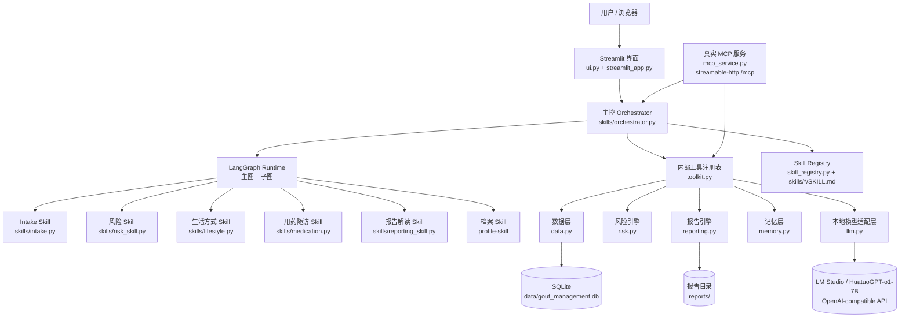
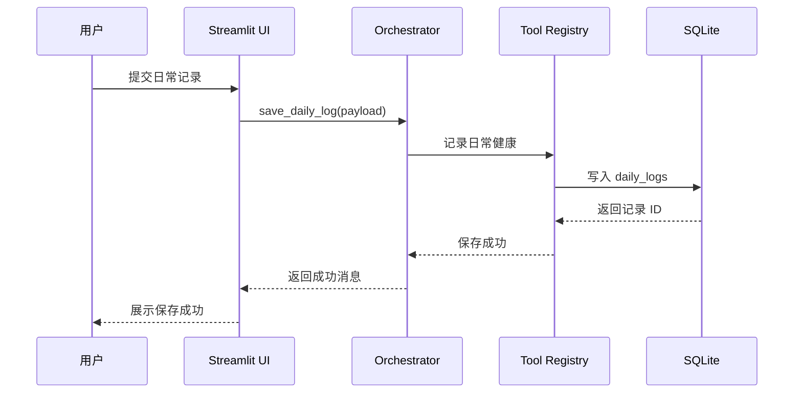
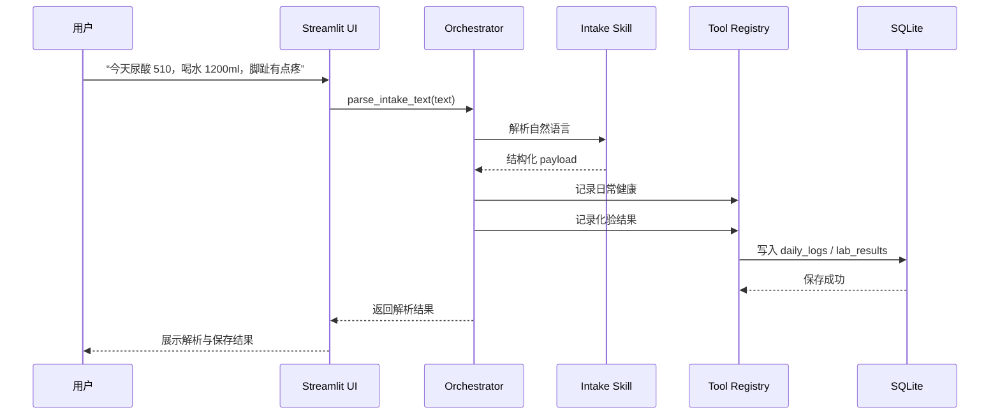
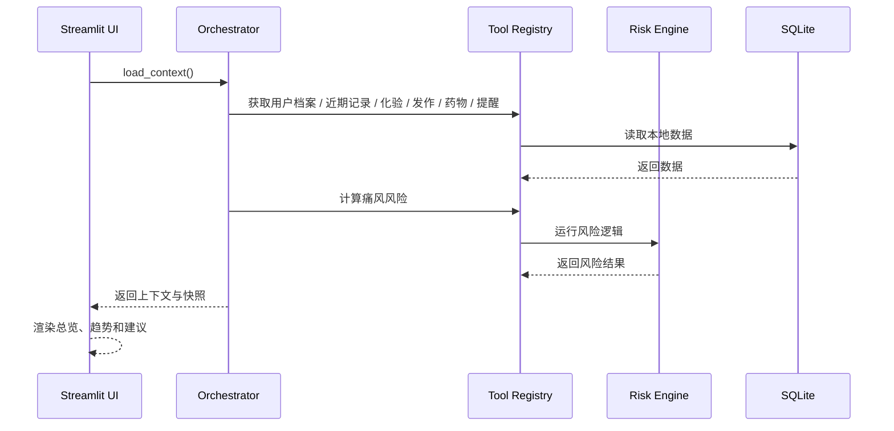
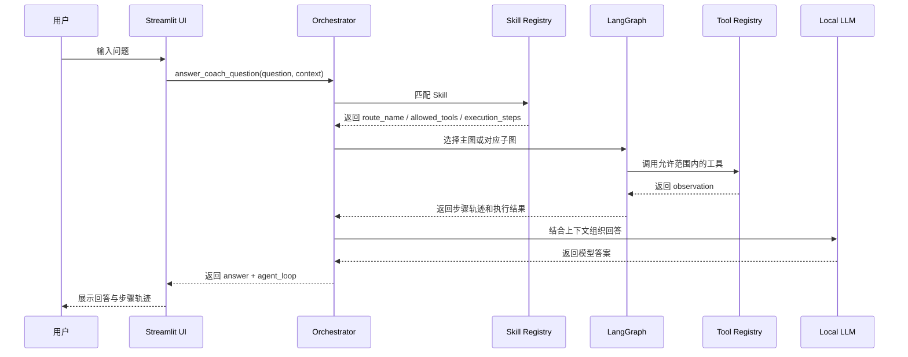
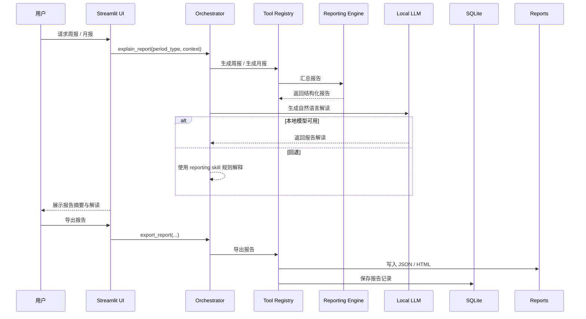
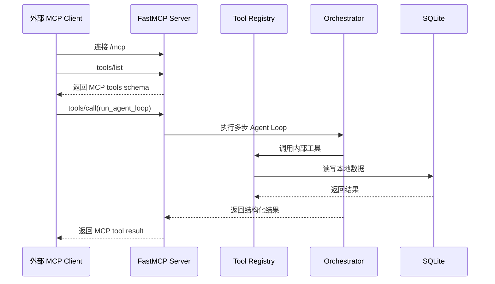

# 项目架构

## 总览

当前项目是一套面向痛风与高尿酸血症长期管理场景的本地优先 Agent，核心由六部分组成：

- Streamlit 中文界面
- SQLite 本地数据存储
- Skill 驱动的主控编排层
- LangGraph 运行时与路由级子图
- 内部工具注册表
- 基于官方 `FastMCP` 的真实 MCP 服务

## 高层架构图

## 分层说明

### 1. 界面层

文件：

- `streamlit_app.py`
- `src/gout_agent/ui.py`

职责：

- 提供中文 Web 界面
- 接收用户录入、提问和报告查看请求
- 把业务行为委托给 orchestrator

### 2. 编排层

文件：

- `src/gout_agent/skills/orchestrator.py`

职责：

- 加载当前上下文
- 根据 `SKILL.md` 和规则路由到对应 skill
- 基于 `allowed_tools` 约束工具调用
- 调用 LangGraph 主图或对应子图
- 在本地模型与规则回退之间协调最终回答

### 3. LangGraph 运行时

文件：

- `src/gout_agent/skills/orchestrator.py`

职责：

- 承载多步 Agent Loop
- 统一运行态与 dry-run 预演态
- 为不同 skill 提供专用子图

当前已经拆出的 LangGraph 子图包括：

- `intake_graph / preview_intake_graph`
- `profile_graph / preview_profile_graph`
- `reporting_graph / preview_reporting_graph`
- `medication_graph / preview_medication_graph`
- `risk_graph / preview_risk_graph`
- `lifestyle_graph / preview_lifestyle_graph`

当前保留的通用主图包括：

- `agent_graph`
- `preview_graph`

主图现在主要负责 `orchestrator` 兜底路径，也就是那些无法明确归类到具体业务 skill 的问题。

### 4. Skill 层

文件：

- `src/gout_agent/skills/intake.py`
- `src/gout_agent/skills/risk_skill.py`
- `src/gout_agent/skills/lifestyle.py`
- `src/gout_agent/skills/medication.py`
- `src/gout_agent/skills/reporting_skill.py`
- `skills/*/SKILL.md`

职责：

- `Intake Skill`：解析自然语言记录
- `风险 Skill`：解释风险、诱因和异常指标
- `生活方式 Skill`：饮食、饮水、运动建议
- `用药随访 Skill`：服药依从性与提醒
- `报告解读 Skill`：周报、月报解释
- `档案 Skill`：用户长期档案与 AI 管理意见维护
- `SKILL.md`：定义技能职责、推荐工具、执行步骤和决策提示词

### 5. 工具层

文件：

- `src/gout_agent/toolkit.py`

职责：

- 把底层能力注册成统一可调用的内部工具
- 提供工具 schema、示例和 trace
- 为 orchestrator 和 MCP 服务复用同一套能力边界

### 6. 真实 MCP 服务层

文件：

- `src/gout_agent/mcp_service.py`

职责：

- 基于官方 `FastMCP` 暴露真实 MCP 服务
- 使用 `streamable-http` 作为传输方式
- 将内部工具映射为 MCP tools
- 暴露 `run_agent_loop` 和 `preview_agent_loop`
- 提供 `gout://profile/current` 和 `gout://memory/latest` 资源

当前 MCP 入口：

- `/mcp`

### 7. 业务与基础设施层

文件：

- `src/gout_agent/data.py`
- `src/gout_agent/risk.py`
- `src/gout_agent/reporting.py`
- `src/gout_agent/memory.py`
- `src/gout_agent/llm.py`

职责：

- `data.py`：SQLite 建表与 CRUD
- `risk.py`：风险计算、诱因识别、异常识别、趋势预测
- `reporting.py`：周报、月报、导出
- `memory.py`：长期记忆、行为画像、AI 管理意见摘要
- `llm.py`：本地 OpenAI-compatible 模型适配

## 当前用到的 Skill

当前项目实际使用的轻量 Skill 包括：

- 主控 Skill
- Intake Skill
- 风险评估 Skill
- 生活方式教练 Skill
- 用药与随访 Skill
- 报告与解读 Skill
- 档案管理 Skill

## 当前用到的 MCP

当前项目已经不再是 “MCP-like” 设计，而是：

- 使用官方 Python SDK `FastMCP`
- 使用真实 MCP `streamable-http`
- 在 `/mcp` 暴露工具与资源
- 让外部 MCP client 可以直接调用项目能力

## 功能请求时序图

### 1. 日常结构化记录提交流程

### 2. 自然语言录入流程

### 3. Dashboard / 风险刷新流程

### 4. AI 教练问答流程

### 5. 报告生成与解读流程

### 6. 真实 MCP 调用流程

