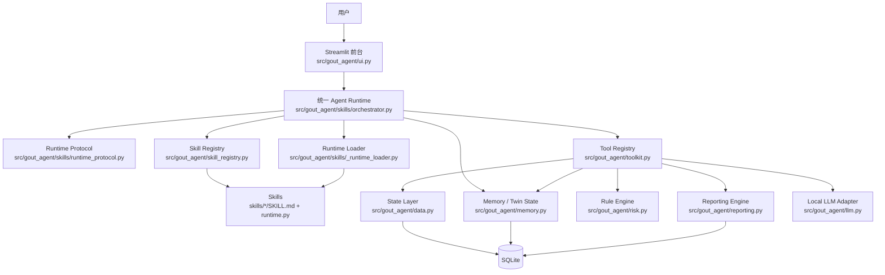

# 项目架构

## 总览

当前项目已经收敛成一套**基于 harness engineering 设计哲学的痛风健康分身 Agent 应用**。  
核心目标不是让模型单独完成所有判断，而是为模型提供一个稳定、可解释、可恢复的运行环境。这个运行环境由：

- 统一 Agent Runtime
- Skill 协议
- Tool 边界
- 外置状态
- 权限与审计
- 后台任务

共同组成。

一句话概括：

**模型负责理解与表达，Harness 负责状态、工具、权限、任务执行和恢复能力。**

---

## 分层架构图

---

## 分层说明

### 1. 前台交互层

职责：

- 提供产品页面与交互入口
- 展示健康分身、风险概览、数据记录、报告中心
- 触发后台任务
- 执行敏感写确认
- 显示运行结果而不是自己做业务判断

关键点：

- 前台开始消费 Harness，而不是绕过 Harness 直接拼业务逻辑
- 健康分身页主要读 `twin_state`
- 报告中心通过 `background_jobs` 接入任务生命周期

---

### 2. 统一 Agent Runtime 层

职责：

- 加载上下文
- 路由 Skill
- 驱动 LangGraph
- 调用 Tool
- 组织解释输出
- 执行写入后的状态刷新
- 管理后台任务执行

关键点：

- `orchestrator.py` 不再承担过多零散业务细节，而更像一个 runtime coordinator
- 通过统一 runtime 协议访问 Skill
- `twin_state` 已成为运行时中心状态

---

### 3. Skill 协议层

职责：

- 用 `SKILL.md` 定义任务说明、推荐工具、执行步骤、写权限
- 用 `runtime.py` 原生实现统一协议：
  - `prepare`
  - `run`
  - `summarize`
  - `persist`

关键点：

- Skill 是按需知识包，不是所有知识一次性塞进上下文
- Skill 既定义“什么时候用”，也定义“能写什么”

---

### 4. Tool 层

职责：

- 把底层能力封装成统一工具
- 给 Skill 提供受控调用接口
- 为每个工具声明：
  - `domain`
  - `access_mode`
  - `sensitive_write`

关键点：

- Tool 不只是函数集合，而是运行环境允许模型调用的“手脚”
- 权限检查和写入边界建立在 Tool 元数据之上

---

### 5. State 层

职责：

- 存储所有关键外部状态
- 提供稳定数据读写
- 提供数据库迁移、备份与版本管理

当前关键状态包括：

- 用户资料、日常行为、部位症状、发作记录、药物与服药记录
- 风险快照 `risk_snapshots`
- 报告摘要 `report_summaries`
- 化验解析结果 `lab_report_parse_results`
- 后台任务 `background_jobs`
- 写操作审计 `write_audit_logs`

关键点：

- 关键状态不只存在于一次对话中，而是都外置落盘
- 这是 harness engineering 中 state externalization 的核心体现

---

### 6. Memory / Twin State 层

职责：

- 生成近 `7/30/90` 天行为画像
- 生成个人健康分身
- 压缩长期上下文，供模型和报告解释使用

当前核心输出：

- `behavior_portraits`
- `digital_twin_profile`
- `memory_summary`
- `report_memory_summary`
- `twin_state`

关键点：

- `twin_state` 不是单独的展示对象，而是全系统中心状态
- 前台展示、解释链路、报告解读都开始围绕它工作

---

### 7. 分析与生成层

职责：

- 规则引擎完成风险评估、诱因识别、异常提示
- 报告引擎生成周报/月报
- 本地大模型负责自然语言解释、建议和化验报告辅助解读

关键点：

- 规则负责“算”
- 模型负责“说”
- Harness 负责“调度、约束和恢复”

---

## 文件对应表

| 分层 | 作用 | 关键文件 |
|---|---|---|
| 前台交互层 | 页面展示、写入确认、任务状态显示 | [ui.py](/d:/ai-gout-management-agent/src/gout_agent/ui.py), [streamlit_app.py](/d:/ai-gout-management-agent/streamlit_app.py) |
| 统一 Agent Runtime | 上下文加载、Skill 路由、LangGraph 执行、后台任务调度 | [orchestrator.py](/d:/ai-gout-management-agent/src/gout_agent/skills/orchestrator.py) |
| Runtime 协议 | 统一 Skill 运行协议 | [runtime_protocol.py](/d:/ai-gout-management-agent/src/gout_agent/skills/runtime_protocol.py) |
| Runtime Loader | 加载顶层 `skills/*/runtime.py` 并包装为统一协议 | [_runtime_loader.py](/d:/ai-gout-management-agent/src/gout_agent/skills/_runtime_loader.py) |
| Skill 注册层 | 解析 `SKILL.md`、提供路由元数据和写权限 | [skill_registry.py](/d:/ai-gout-management-agent/src/gout_agent/skill_registry.py) |
| Skills 定义层 | 任务手册与原生运行时实现 | [skills](/d:/ai-gout-management-agent/skills) |
| Tool 层 | 统一工具注册与工具元数据 | [toolkit.py](/d:/ai-gout-management-agent/src/gout_agent/toolkit.py) |
| State 层 | 数据读写、迁移、快照、任务和审计 | [data.py](/d:/ai-gout-management-agent/src/gout_agent/data.py) |
| Memory / Twin State 层 | 行为画像、健康分身、上下文压缩 | [memory.py](/d:/ai-gout-management-agent/src/gout_agent/memory.py) |
| 风险规则引擎 | 风险评估、诱因识别、异常提示 | [risk.py](/d:/ai-gout-management-agent/src/gout_agent/risk.py) |
| 报告引擎 | 周报/月报生成与结构化输出 | [reporting.py](/d:/ai-gout-management-agent/src/gout_agent/reporting.py) |
| 本地模型适配层 | 问答、解读、视觉化验辅助解析 | [llm.py](/d:/ai-gout-management-agent/src/gout_agent/llm.py) |
| 测试层 | 验证运行时、状态迁移、后台任务与权限机制 | [tests](/d:/ai-gout-management-agent/tests) |

---

## 当前最重要的运行链路

### 1. 数据记录链路

用户输入  
→ 前台收集数据  
→ Runtime 路由到对应 Skill  
→ 调用允许范围内的 Tool  
→ 写入数据表  
→ 刷新 `risk_overview` 与 `twin_state`  
→ 返回前台更新后的状态

### 2. 报告中心链路

用户点击生成周报 / 月报  
→ 创建 `background_jobs`  
→ Runtime 处理后台任务  
→ 保存 `report_summaries`  
→ 前台读取任务状态与摘要  
→ 调用模型做最终解读

### 3. 敏感写链路

用户发起敏感写操作  
→ 前台要求显式确认  
→ Runtime 检查 `sensitive_write` 和 `write_permissions`  
→ 写入成功或失败都落 `write_audit_logs`  
→ 刷新状态并回到前台

---

## 这个架构为什么符合 harness engineering

这套项目不是“一个会聊天的模型”，而是一个**由运行环境驱动的 Agent 系统**：

- **Skill** 解决模型“知不知道怎么做”
- **Tool** 解决系统“能不能真正执行”
- **State** 解决结果“能不能落盘、恢复、复用”
- **Permission** 解决写操作“能不能被安全约束”
- **Background Jobs** 解决重任务“能不能脱离同步交互持续运行”

最终形成的是：

**一个以 `twin_state` 为核心状态中心、以 Skill/Tool/Permission/Background Jobs 为运行环境、让模型在受控系统中工作的痛风健康分身 Agent Runtime。**
